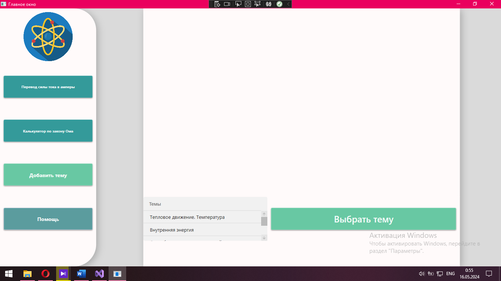
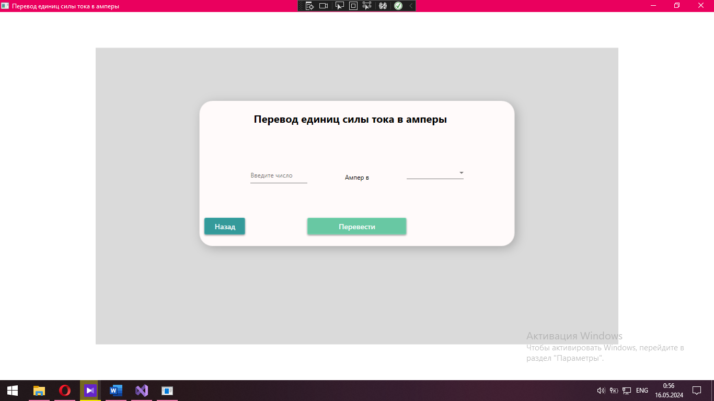
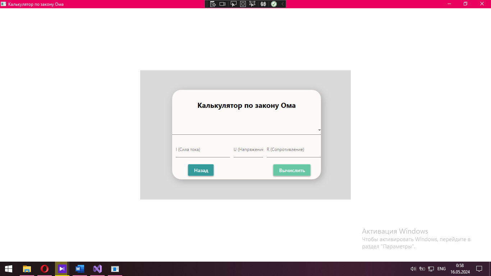
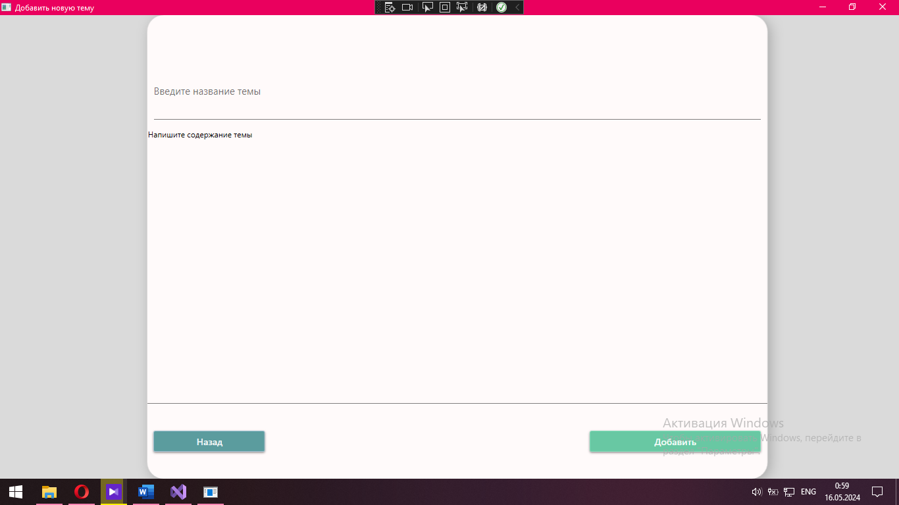
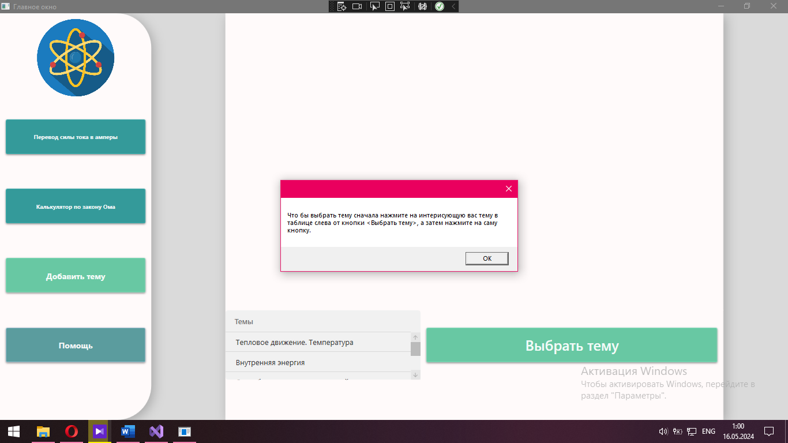

<h1 style="text-align:center;">Information-System-For-The-School-Subject-Physics</h1>
<h2 style="text-align:center;">Информационная система по школьному предмету “Физика”</h2>

<h3>Описание:</h3>

  Данный проект представляет из себя подобие учебника физики в котором пользователь может:

<ul>
  <li>Просматривать темы по предмету "Физика"</li>
  <li>Добавлять свою тему</li>
  <li>Переводить единицы силы в амеры с помощью специального калькулятора</li>
  <li>Вычислять закон Ома с помощью специального калькулятора</li>
</ul>

<h3>В ходе создания проекта применялись такие технологии как:</h3>
<ul>
  <li>Язык программирования C#</li>
  <li>Среда разработки Visual Studio</li>
  <li>СУБД SQL Server Management Studio (SSMS)</li>
  <li>Язык разметки XAML</li>
</ul>

<h3>Скриншоты проекта:</h3>
<figure>
	
	
Рисунок 1 - главное меню

</figure>
<figure>
	
	
Рисунок 2 - окно калькулятора перевода едениц тока в амперы

</figure>
<figure>
	
	
Рисунок 3 - калькулятор вычисленя закона Ома

</figure>
<figure>
	
	
Рисунок 4 - окно для добавления новой темы

</figure>
<figure>
	
	
Рисунок 5 - что выведется если нажать на кнопку "Помощь"

</figure>

<h3>Видео демонстрация:</h3>

https://github.com/NecroDieMon/Information-System-For-The-School-Subject-Physics/assets/116455805/9a404c70-a30b-4fc0-ab4e-4f934c6bb99d

